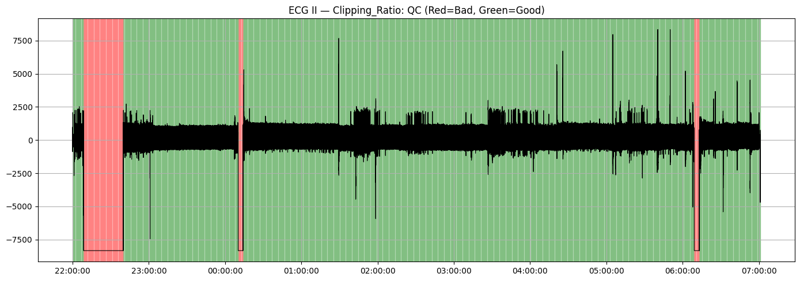
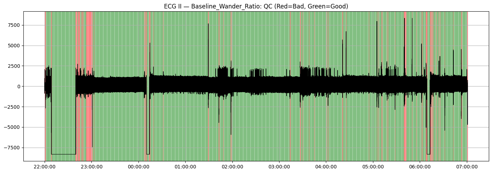
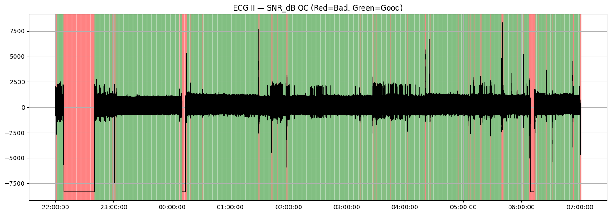
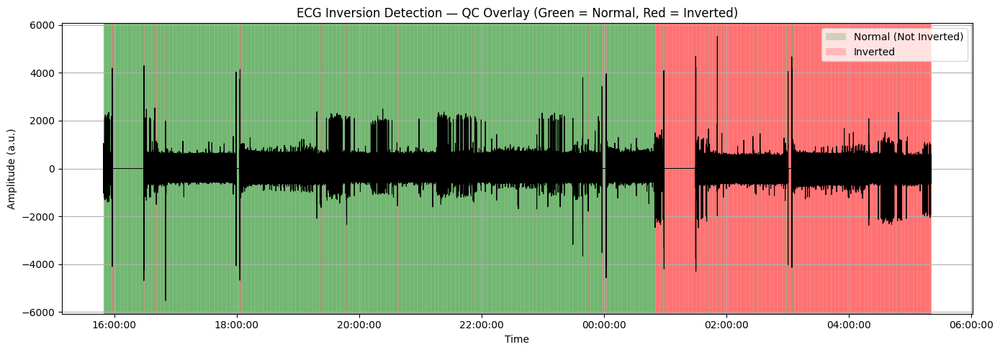
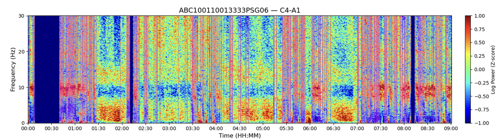
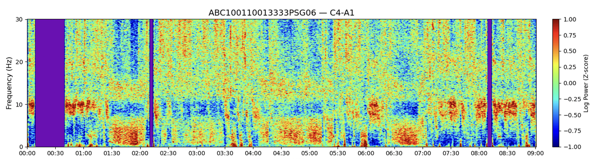
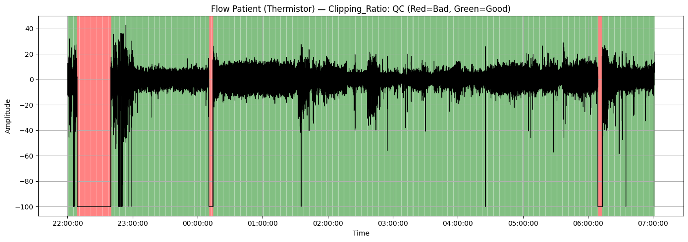
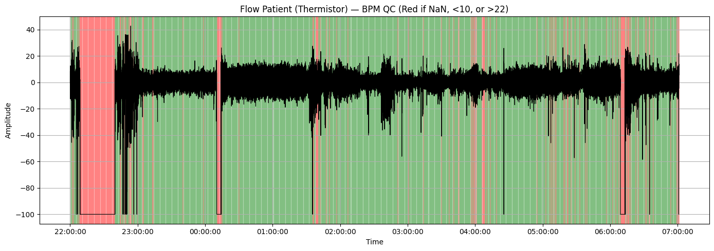
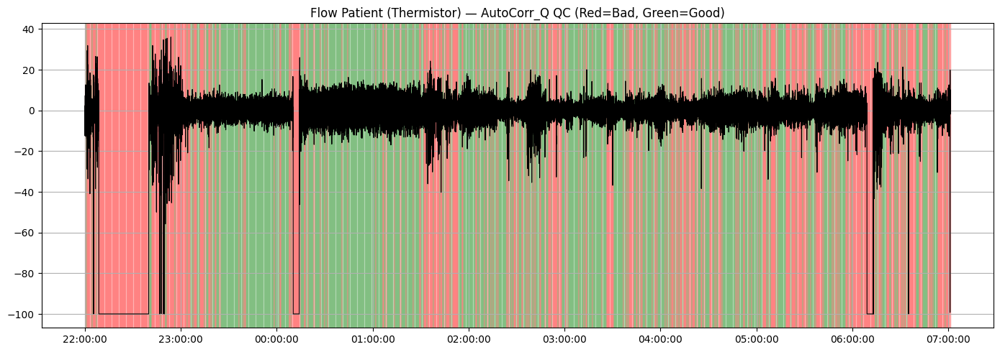

#  physio-qc-toolkit

A lightweight **Python toolkit** for **physiological signal quality control (QC)** and visualization across multimodal PSG and wearable data (e.g., ECG, thermistor airflow, pressure).

---

##  Environment Setup

- **Python 3.11**
- Install dependencies via:
  ```bash
  pip install -r requirements.txt

##  Overview

This toolkit provides an **end-to-end pipeline** to:
1. **Read EDF files** and extract channel data into structured DataFrames  
2. **Run signal quality checks** (QC) on ECG, EEG, respiratory, and other biosignals  
3. **Compute per-epoch metrics** such as clipping, flatline ratio, missing data, baseline drift, HR, and SNR  
4. **Visualize quality flags** with color-coded (red/green) spans  
5. **Generate JSON summaries** for automated downstream analyses

---

## 📂 Repository Structure

```bash
physio-qc-toolkit/
├── assets/                  # Static figures used in README/docs
├── data/                    # Small sample data to re-run examples
├── docs/                    # Documentation (usage, design notes)
├── quality/                 # QC pipelines, metrics, and visualization
├── utils/                   # I/O & helpers (EDF readers, filters, utils)
├── edf_signal_quality.ipynb # Main notebook to run + visualize QC
├── LICENSE
├── README.md
└── __init__.py
```

## **Features**

- **EDF Reader:** Handles EDF headers, sampling rates, labels, and transducers  
- **Channel Disambiguation:** Creates unique labels when duplicates exist  
- **Epoch-Based QC:** 30 s windows (configurable) with per-epoch statistics  
- **Metrics:**  
  - **ECG Signals**  
    - **Clipping Ratio** (`>50%` = bad)  
    - **Flatline Ratio** (`>50%` = bad)  
    - **Missing Ratio** (`>50%` = bad)  
    - **Baseline Wander** (`>15%` power < 0.3 Hz = bad)  
    - **Heart Rate Range** (`25–220 bpm`)  
    - **SNR** (`<6 dB` = bad)  
  - **EEG Signals**
    - **Artifact Ratio (AR):** `> 6` → **Artifactual**
    - **Flatline Ratio:** `≥ 98%` identical samples → **Bad**
    - **Spectral Normalization:** Normalize power within **1–40 Hz** before QC
  - **Flow Signals (Thermistor / Pressure)**  
    - **Clipping Ratio** (`>50%` = bad)  
    - **Flatline Ratio** (`>50%` = bad)  
    - **Missing Ratio** (`>50%` = bad)  
    - **Respiration Rate** (`<10 bpm`, `>22 bpm`, or NaN = bad)  
    - **Autocorrelation** Quality (<0.5 = bad; low periodicity indicates irregular or noisy respiration)
- **Visualization:**  
  - Per-metric and overall QC plots (🟢 green = good, 🔴 red = bad)  
- **JSON Export:**  
  - Ratio of good / bad epochs per metric and per-signal summary  
---

##  Example Usage

```python
from read.read_edf import read_edf_to_dataframes
from quality.run_qc import run_ecg_qc
```

### Step 1: Read EDF file
channel_dataframes = read_edf_to_dataframes("ABC100110013333PSG06.edf")

### Step 2: Run QC on ECG II
```python
qc_df, per_metric_json, overall_json = run_ecg_qc(
    "ECG II",
    channel_dataframes=channel_dataframes,
    fs=200,
    epoch_len=30,
    thresholds={
        "clipping_max": 0.50,
        "flatline_max": 0.50,
        "missing_max":  0.50,
        "baseline_max": 0.15,
        "hr_min": 25.0,
        "hr_max": 220.0,
        "snr_min": 6.0,
    },
    json_path="qc_summary.json",
    plot="per-metric"
)
```

### Step 3: Print summary
print(overall_json)

Output Example
```
=== Overall QC Summary ===
{'total_epochs': 180, 'good_epochs': 157, 'bad_epochs': 23, 'good_ratio': 0.872, 'bad_ratio': 0.128}

===  Per-metric === 
{
  "Clipping": {"good_ratio": 0.98, "bad_ratio": 0.02},
  "Flatline": {"good_ratio": 1.00, "bad_ratio": 0.00},
  "Missing": {"good_ratio": 0.97, "bad_ratio": 0.03},
  "Baseline": {"good_ratio": 0.85, "bad_ratio": 0.15},
  "HR_Mean": {"good_ratio": 0.90, "bad_ratio": 0.10},
  "SNR_dB": {"good_ratio": 0.95, "bad_ratio": 0.05}
}
```

## ECG Visualization

Each 30-second epoch is shaded according to QC results:
- 🟢 **Green** → passes all quality checks  
- 🔴 **Red** → fails at least one metric threshold  

### 🫀 ECG Signal Quality Examples

| Clipping Ratio | Baseline Wander | SNR (Signal-to-Noise Ratio) |
|:---------------:|:----------------:|:---------------------------:|
|  |  |  |


## 🔉 Signal-to-Noise Ratio (SNR) Calculation

The **SNR metric** quantifies the ratio of meaningful ECG activity to background noise, providing an estimate of overall ECG signal integrity.

### ⚙️ How It Works

During feature extraction, short **±0.1 s windows** centered around each detected **R-peak** are isolated.  
For each heartbeat:

1. Extract the **raw ECG segment** (`ecg`) and the **cleaned version** (`ecg_cleaned`)  
2. Aggregate all paired segments across beats  
3. Compute **signal power** and **noise power**

**Formula:**  
`SNR (dB) = 10 × log10(Signal Power / Noise Power)`
where:  

- **Signal Power = Var(raw ECG)**  
- **Noise Power = Var(raw ECG − cleaned ECG)**  

---

### 📈 Interpretation

| SNR Range | Signal Quality | Description |
|:-----------:|:---------------:|:-------------|
| **> 6 dB** | 🟢 Good | Clean ECG waveform, stable R-peaks |
| **≤ 6 dB** | 🔴 Poor | Noisy or motion-corrupted ECG, unstable morphology |

A higher SNR indicates that cardiac activity dominates noise sources such as motion artifacts, electrode detachment, or baseline wander.

## ⚡ ECG Inversion Detection

The **Inversion QC metric** identifies ECG epochs with **reversed polarity**, often caused by **electrode misplacement** or **inverted leads**.  
It quantifies polarity reversal by comparing each cleaned ECG segment with its absolute version.

### **Formula**

`inv_ratio = (1 - corr(ECG, |ECG|)) / 2`  
where:  

- **inv_ratio < 0.5** → upright ECG (normal polarity)  
- **inv_ratio > 0.5** → inverted ECG (reversed polarity)

---

### 📈 Interpretation

| inv_ratio Range | Signal Quality | Description |
|:----------------:|:---------------:|:-------------|
| **< 0.5** | 🟢 Normal | Upright ECG waveform, correct polarity |
| **≥ 0.5** | 🔴 Inverted | Reversed ECG polarity, flipped P–QRS–T waves |

A higher inversion ratio indicates stronger waveform reversal, typically due to lead reversal or incorrect electrode placement.

---

#### 🩺 Inversion Visualization

| Inversion Detection |
|:-------------------:|
|  |  

---

## 🧠 EEG Artifact Detection QC

Automatically identifies epochs contaminated by **low-frequency drift**, **movement**, or **high-frequency EMG** noise.  
Each 30-second epoch is transformed via **FFT**, spectral amplitudes are **normalized by the mean power in 1–40 Hz**, and then **log-transformed (base 10)** prior to evaluation.

**Triple-Ratio Metric (Formula)**  
`AR = (SP_0.1–2Hz / SP_2–5Hz) × (1 / SP_40–50Hz)`  
where **SP** is the mean spectral power within each band.  
**Decision:** epochs with `AR > 6` → **Artifactual**.

**Rationale**  
Empirically derived from labeled sleep EEG: contaminated epochs consistently showed **elevated 0.1–2 Hz** (drift) and **40–50 Hz** (EMG) relative to **2–5 Hz** mid-band activity. Thresholds are **sleep-calibrated**; awake periods with strong alpha or muscle activity may be flagged more often.

### 📈 Interpretation

| Metric | Threshold | Signal Quality | Description |
|:------:|:---------:|:--------------:|:------------|
| **AR ≤ 6** | Acceptable | Clean | Minimal drift/EMG contamination |
| **AR > 6**  | Artifactual |  Noisy | Drift and/or high-frequency EMG |

## EEG Visualization

| EEG Artifact Detection |
|:-----------------------:|
|  |
repeats.


## ⚡ EEG Flatline Detection QC

Flags epochs with **abnormally low amplitude** or **loss of variability**, typically due to **electrode disconnection**, **high impedance**, or **amplifier saturation**.  
Each 30-second epoch is evaluated using:
1. **Signal variance**  
2. **Peak-to-peak amplitude**  
3. **Proportion of repeated consecutive samples**

**Decision Rules**  
- **Suppressed signal:** variance and peak-to-peak **below 20% of the 5th percentile** of all epochs → potential dropout  
- **Complete flatline:** `≥ 98%` identical samples → **Flatlined**

### 📈 Interpretation

|          Metric         |                 Threshold                | Signal Quality | Description                               |
| :---------------------: | :--------------------------------------: | :------------: | :---------------------------------------- |
| Variance & Peak-to-Peak | **≥ 20% of the 5th-percentile baseline** |     Clean    | Normal EEG variability                    |
| Variance & Peak-to-Peak | **< 20% of the 5th-percentile baseline** |     Low     | Suppressed amplitude / possible dropout   |
|     Repeated Samples    |   **≥ 98% identical samples in epoch**   |     Bad     | Flatline: channel dropout / disconnection |

**Visualization**

| EEG Flatline Detection |
|:-----------------------:|
|  |

## 🧾 Example Output — EEG QC (Channel C4)

```
{
  "total_epochs": 1082,
  "clean_epochs": 592,
  "noisy_epochs": 416,
  "flatline_epochs": 74,
  "clean_ratio": 0.547,
  "artifact_ratio": 0.453,
  "noisy_ratio": 0.384,
  "flatline_ratio": 0.068
}
```

### 🌬️ Flow Signal Quality Examples

| Clipping Ratio | BPM (Respiration Rate) | Autocorrelation QC |
|:---------------:|:----------------------:|:------------------:|
|  |  |  |

### Autocorrelation Quality (Respiratory Regularity)

The autocorrelation quality metric evaluates how periodic and consistent a respiratory or flow signal is over time.
It measures the similarity of a signal with a time-shifted version of itself within a short lag window (typically up to 10 seconds).
A high autocorrelation peak (close to 1.0) indicates stable, rhythmic breathing cycles with well-defined periodicity.
A low autocorrelation value (near 0.0) suggests irregular or noisy respiration, such as disrupted airflow, clipping, or flatline segments.
The method automatically penalizes heavily clipped or nearly constant (flatline) signals by assigning them a score of 0.

License
This project is licensed under the MIT License — see the LICENSE